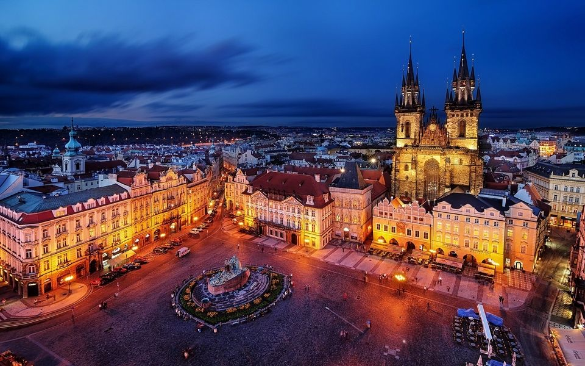
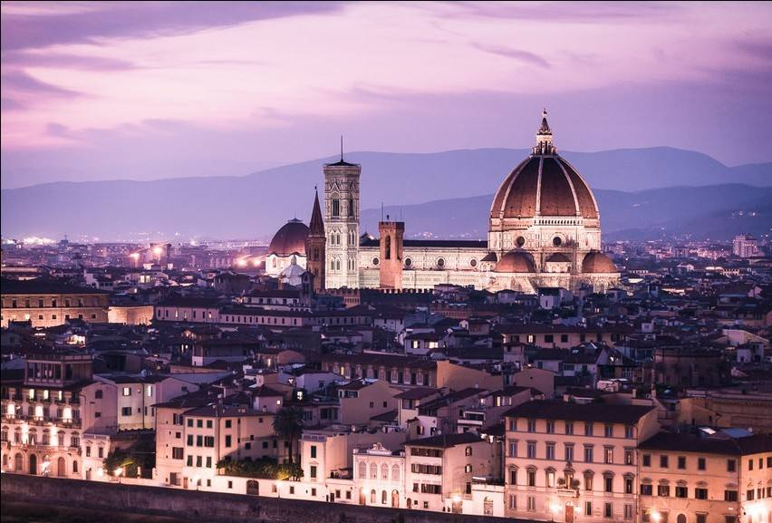

# DeepDream

DeepDream is an art of image modification which was first released in 2015. It can generate psychedelic images. DeepDream runs a neural network in reverse: gradient ascending the input of CNN to maximize the activation value of filters in CNN. In DeepDream, we try to maximize  the activation value from all layers, and we start it with an existing image, not blank, noisy input. In addition to, the input images are processed in different octaves to improve the quality of visualization. The model we use is Inception V3. We use keras to implement it. 

## Input images:

## Output images:
