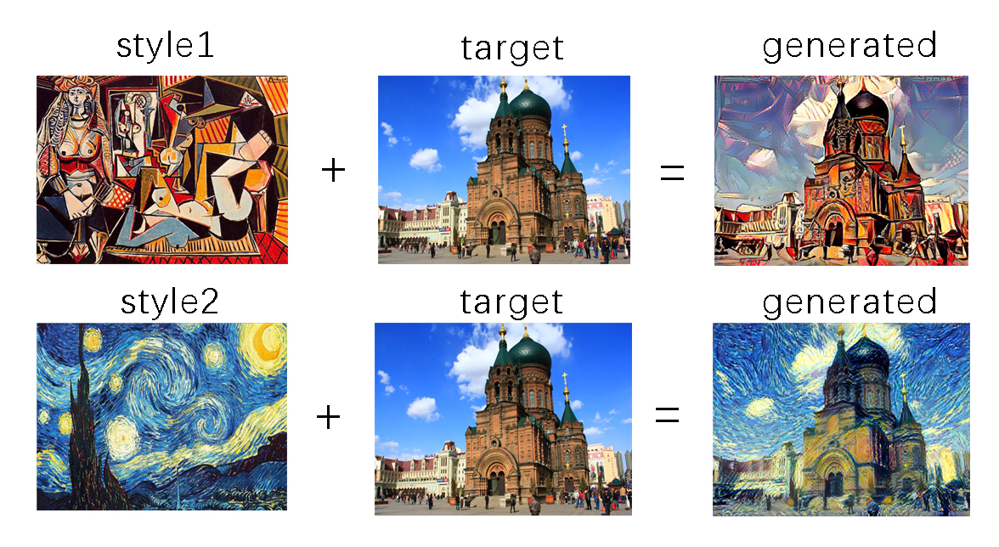

# Neural Style Transfer

Neural style transfer is to apply the style of the reference image to the target image while retaining the content of the target image. We design three kinds of loss function to minimize them: content loss, style loss and total variation loss. In the code we use two style images and a target image, the results are shown in the figure below.

