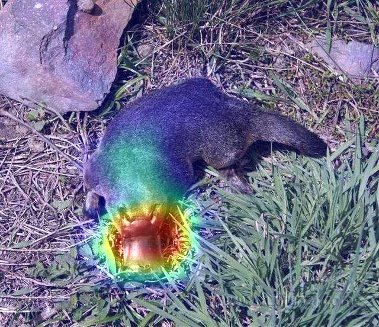

# Visualization

Deep learning is a black box model, and the interpretability of neural network is a hot research direction. Since 2013, there are many technologies to visualize and interpret models. Here we use three technologies that are most easy to understand: visualize the intermediate output of CNN, visualize the filters, and visualize class activation map (CAM).

## Visualize the intermediate output of CNN

For the specified input, we will show the output of each convolution layer and pooling layer in the network.

- The specified input, a cat image:

- Several output of each convolution layer and pooling layer in VGG19 (We visualize all layers of model in code):

## Visualize the filters

We use gradient ascent to achieve visualization of filters in the input space. Start with a blank image and maximize the response of a filter. The model we use is VGG19, and we view the first 64 filters in each layer, and view only at the first layer of each convolution block.

- Output filters visualization:

## Visualize class activation map (CAM)

The method called CAM helps to understand which parts of an image allow CNN to make the final classification decision. Given an input image, for the output feature maps of a convolution layer, each channel in these feature maps is weighted by the gradient of the category relative to the channel.

- The input image (duckbill or platypus):

- Output CAM:

- Stack the heatmap with the original one:

